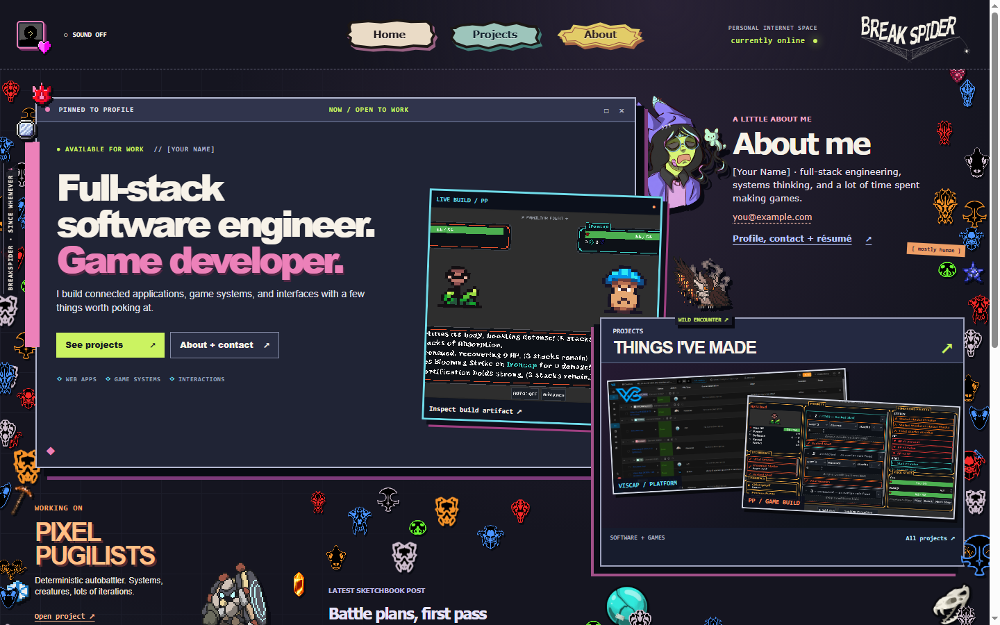
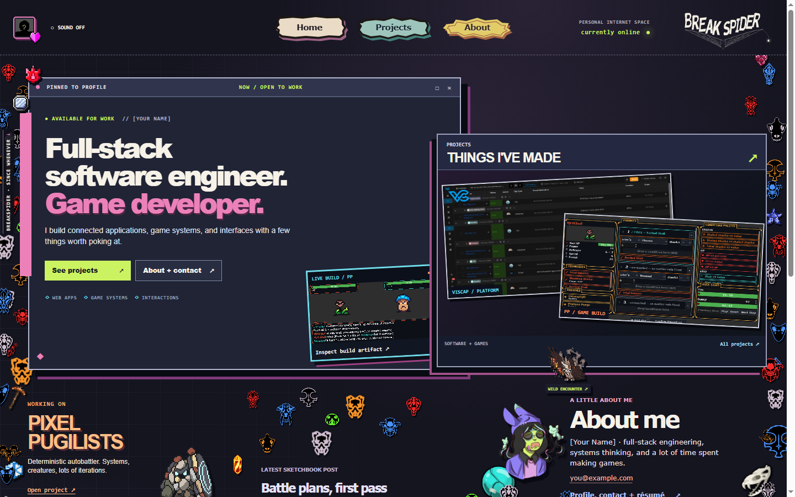
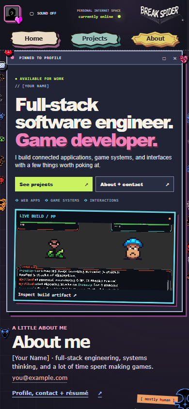
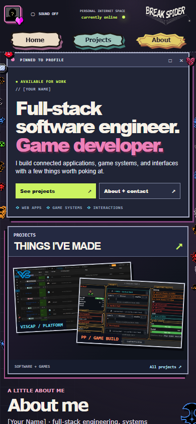

# Prototype 04 → 05, first-screen comparison

These are captures of the actual local builds at the same viewport sizes. Prototype 04 is unchanged. The pink, cyan, and orange graphics, sticker navigation, and crowded margins remain; the arrangement of the main content changes.

## Desktop, 1440 × 900

| 04 | 05 |
| --- | --- |
|  |  |

In 04, About sits beside the profile and Projects starts lower. A large game capture crosses the profile's right edge. In 05, Projects rises beside the profile as a larger work window. The game capture becomes a smaller artifact tucked behind that window; About and the portrait move below it. The work is visible sooner without stripping out the personal clutter.

## Mobile, 390 × 844

| 04 | 05 |
| --- | --- |
|  |  |

In 04, the game capture and About come before Projects. In 05, Projects immediately follows the profile. The hero's duplicate game capture is removed at this width, while About remains one scroll lower and keeps its top-level sticker and profile link.

## Other visible route changes

- [Projects in 05](05-projects-desktop.png): the first project starts higher, with a smaller but still loud archive heading.
- [Sketchbook in 05](05-sketchbook-desktop.png): the first post appears sooner under the title and filters.

The rest of 05 tests smaller route-specific fixes listed in the [prototype README](../README.md).
